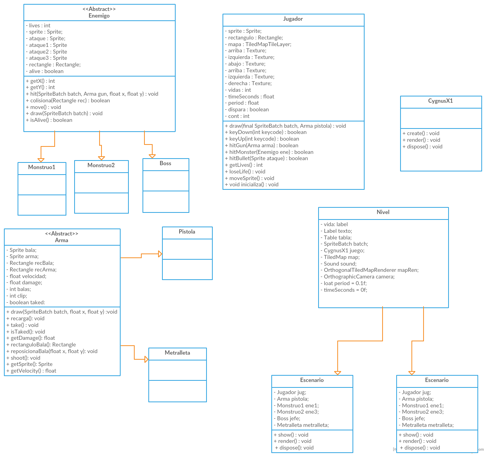
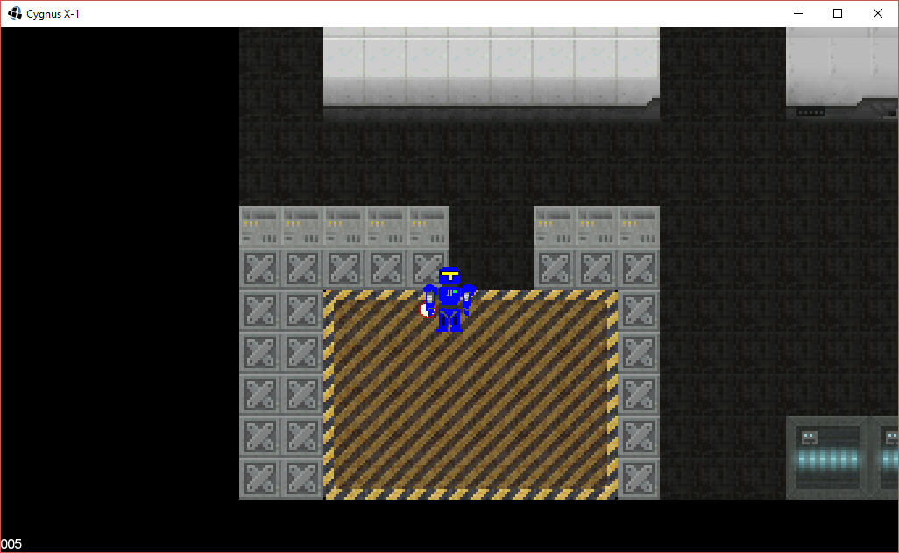
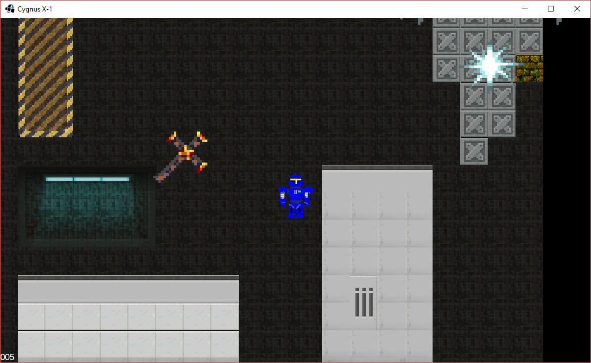
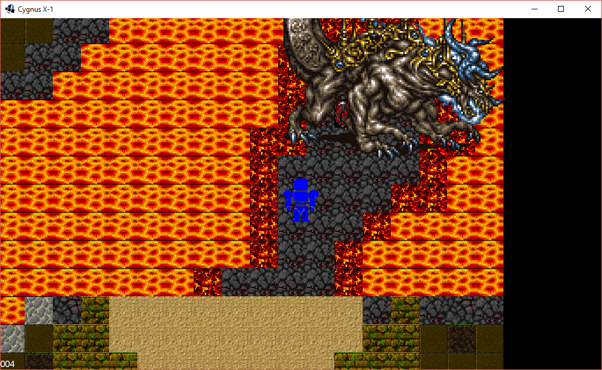

### Objetivo del juego/aplicación
El objetivo del juego es entretener al usuario y hacer que juegue un poco del juego hecho en java y que conozca más sobre este lenguaje y lo que es capaz, aplicando los conocimientos aprendidos en la materia de Programación Orientada a Objetos.

### Descripción del juego/aplicación
Es un juego tipo RPG (Role Playing Game), donde el soldado de clave X-1 continúa su aventura después de haber derrotado a su clon creado por la raza enemiga. 
 
Ahora el soldado que se encontraba en la nave enemiga, deberá dirigirse mediante el mundo lleno de enemigos para matar a los jefes finales de cada uno

El juego tendrá dos niveles en que se juega, por una parte está el mundo abierto donde controlamos desde una vista aérea a X-1 mientras lo guiamos hasta sus destinos, habrá monstruos que atacan e intentarán matar al jugador, pero el jugador cuenta con varias armas en el mundo que le permitirán tener diferentes ataques y ser más poderoso

Cada combate nos generara experiencia lo cual hará que X-1 se haga cada vez más fuerte.

### Clases principales y sus características
1. Jugador
* Nos permite movernos a traves del mundo
* Ataca con distintas armas que se pueden encontrar
* Tiene 5 vidas

2. Nivel
* Nos muestra el escenario del juego desde una vista aerea.
* Moveremos al personaje desde aqui.
* El escenario contiene paredes, armas y enemigos

3. Enemigo
* Puede tener distintos ataques
* Se mueve indepentiendemente
* Tiene mas vida que el jugador

4. CygnusX1
* Es la clase principal del juego
* Permite que se llamen las clases siguientes

### Diagrama de clases

### Imágenes del juego

El personaje inicia con 5 vidas y va recorriendo un mundo lleno de obstaculos y enemigos y armas que hacen variada su existencia

Las armas encontradas proveen de diferentes ataques y velocidad

Los enemigos pueden moverse y tienen diferentes ataques

Cada niveles diferente al anterior, contienen otras cosas
###Link del video
<iframe width="560" height="315" src="https://www.youtube.com/embed/Kv9hWnkfWlQ" frameborder="0" allowfullscreen></iframe>

### Autor(es)
El autor(es) del proyecto son:
- Gonzalez Patiño Oscar Armando (@Morcado)
- Hernandez Alonso Hector Andrey (@AndreyAlonso)

### Materia(s)
- Programación Orientada a Objetos

### Semestre
- 2016-2017/II
