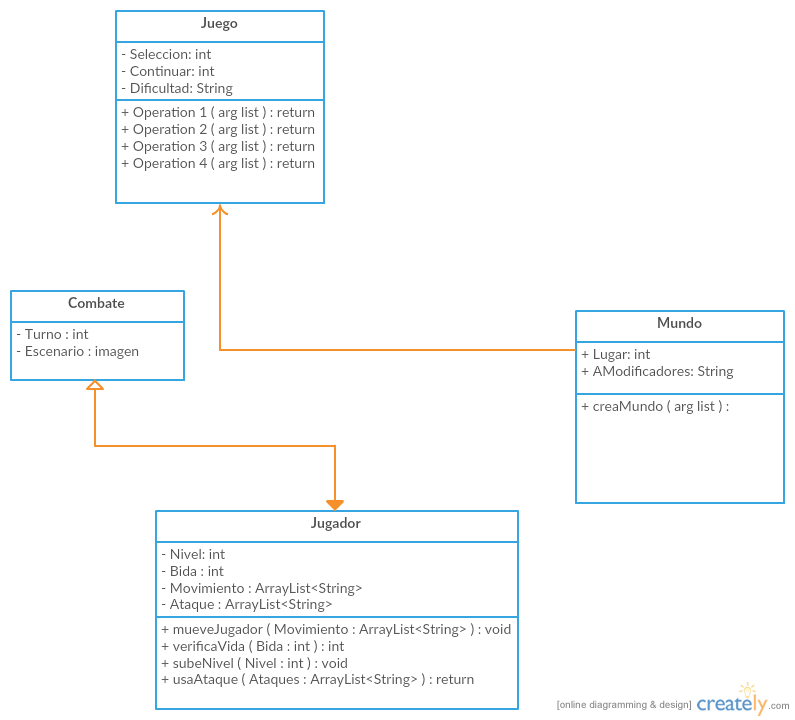
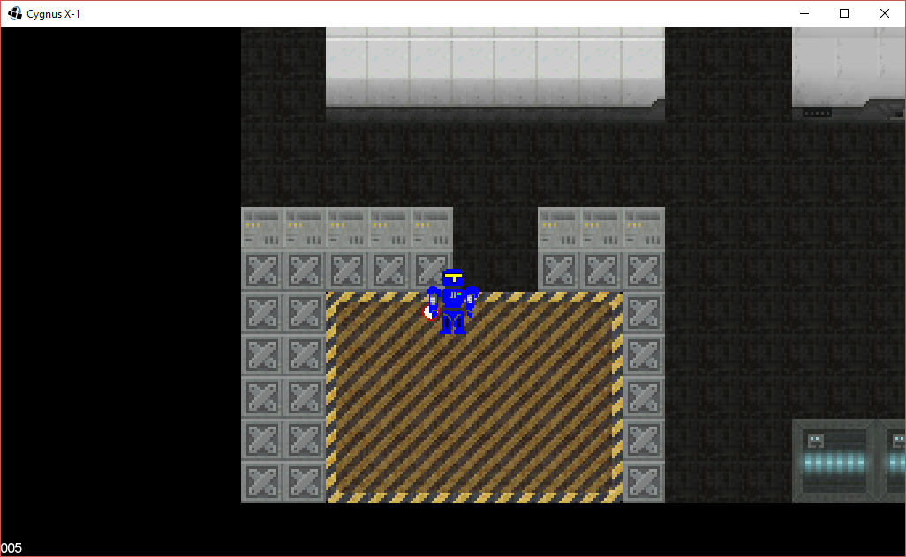
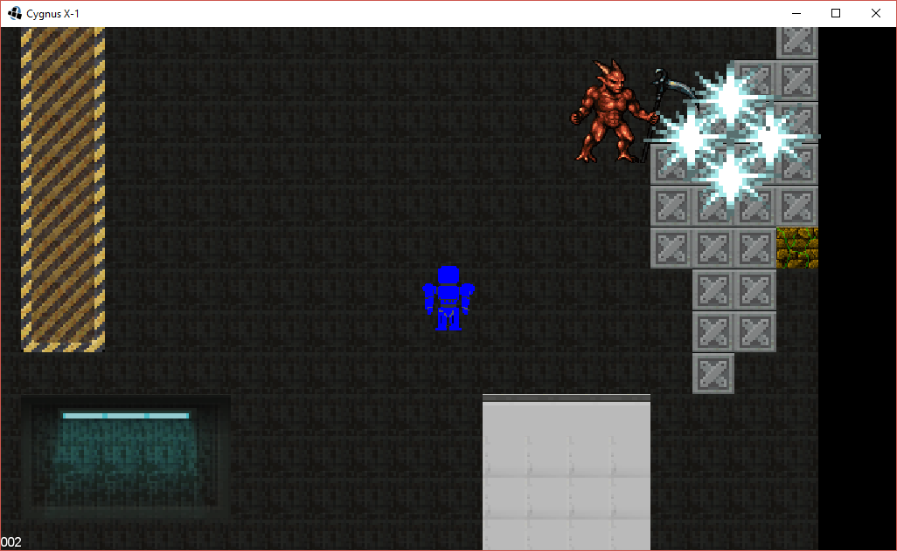
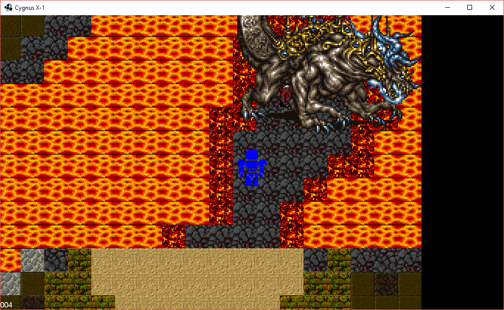

### Objetivo del juego/aplicación
El objetivo del juego es entretener al usuario y hacer que juegue un poco del juego hecho en java y que conozca más sobre este lenguaje y lo que es capaz, aplicando los conocimientos aprendidos en la materia de Programación Orientada a Objetos.

### Descripción del juego/aplicación
Es un juego tipo RPG (Role Playing Game), donde el soldado de clave X-1 continúa su aventura después de haber derrotado a su clon creado por la raza enemiga. 
 
Ahora el soldado que se encontraba en la nave enemiga, deberá dirigirse mediante complicadas batallas al planeta enemigo para poder acabar con ellos.

El juego tendrá dos modos diferentes en que se juega, por una parte está el mundo abierto donde controlamos desde una vista aérea a X-1 mientras lo guiamos hasta sus destinos mientras intentamos escapar de los enemigos, pero si un enemigo llega a tocar a X-1 la visualización del juego cambia ya que ahora entramos a un modo combate y podemos pelear mediante turnos con los enemigos, contando con un apartado de pelea donde escogeremos de qué manera atacar, otro apartado sería el de opciones que nos permite reparar si X-1 se encuentra dañado de su armadura.

Cada combate nos generara experiencia lo cual hará que X-1 se haga cada vez más fuerte.

### Clases principales y sus características
1. Juego
* Nos permite seleccionar la dificulad del juego.
* Continuar la partida del juego.
* Seleccionar un elemento del menu,

2. Mundo
* Nos muestra el escenario del juego desde una vista aerea.
* Moveremos al personaje desde aqui.

3. Combate
* Sucede el evento de una pelea contra un enemigo.
* Se manejara por turnos.
* La batalla acaba cuando el primero pierda.

4. Jugador
* Será controlado por el usuario.
* Nos mostrara dos aspectos fisicos desde la vista del mundo y la del combate.
* Contara con diferentes antributos para sus ataques.

### Diagrama de clases

### Imágenes del juego

### Autor(es)
El autor(es) del proyecto son:
- Gonzalez Patiño Oscar Armando (@Morcado)
- Hernandez Alonso Hector Andrey (@AndreyAlonso)

### Materia(s)
- Programación Orientada a Objetos

### Semestre
- 2016-2017/II
